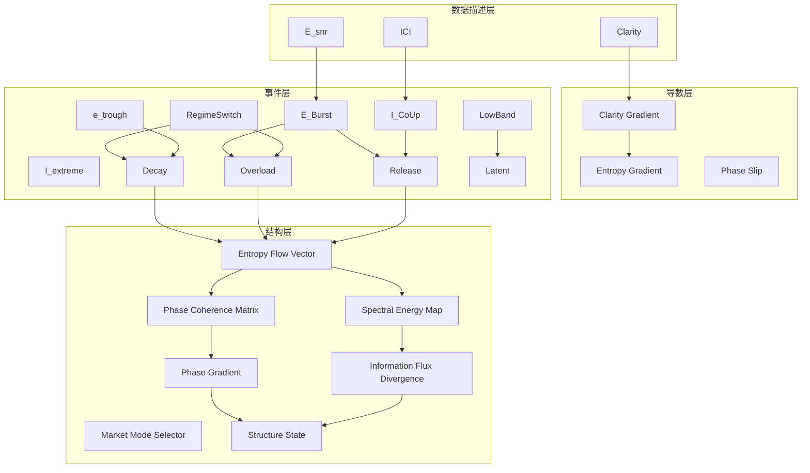

# InfoFlow · L4_V3 回测总结（含 V1/V2 对照）

> 面向：策略治理 / 研究里程碑记录  
> 版本：V3（对照 V1 / V2）  
> 结论关键词：**理论未跑偏**｜**模型未收敛**｜**结构稳定**｜**算子化转向（L5 前置）**

---

## 0. 摘要（TL;DR）
- **理论未跑偏**：V3 在加入能量与跨带约束后，事件效应呈**有结构的分化**：`Decay>Overload>Release≈0`（中短窗），与“信息流熵循环”一致。这是**非偶然噪声**的证据。
- **模型未收敛**：Release 在不同阈值/相干条件的**灵敏度曲线近似平台**（δ≈0.13–0.15），说明当前口径不是主控变量；V3 对参数的响应**缺乏单调性**，提示需转向**结构层建模**而非继续微调阈值。
- **结构稳定**：在 1m→5m→15m 的尺度中，效应量**同向递减且无符号翻转**；`Overload/Decay` 与 `Release` 的**语义分工**清晰，策略没有出现自我矛盾或循环污染。
- **方法论跃迁**：放弃“同名指标跨代保持同义”的强假设，转为把事件**视作独立算子**（operators）。L5 的任务从“聚合特征”切换为**跨层算子耦合（相位/能谱）建模**。

---

## 1. 试验设计与口径变化（V1→V2→V3）

### 1.1 版本口径对照
- **V1（点事件/慢变量导数）**：基于 `clarity/ICI` 的阈值与顺序事件；实质上观测的是**状态转移的导数**（趋势性拐点）。
- **V2（能量引入的过渡版）**：引入 `E_snr`（低频/总能量）但对跨带/相位约束较弱；事件仍与“导数点”有高度重叠。
- **V3（能量+跨带的算子化版）**：
  - `Release := (E_snr_z≥z★) ∧ (Δγ≥θ) ∧ (¬RegimeSwitch)` → **盆内能量点火**；
  - `Overload := RegimeSwitch ∧ I_extreme` → **跨盆能量跃迁**；
  - `Decay := (phase_slip ∪ E_trough) ∧ RegimeSwitch` → **结构破裂后的熵回升**。

> 注：V3 将 V1 的“势变化”语义改写为“场强状态”，导致 **Release 的物理量纲变化**（见 §3）。

### 1.2 数据与产物（要点）
- 统一输出：`events_l4_{tf}_wide.parquet`、`events_l4_{tf}_long.parquet`；合并统计：`effect_size_all.csv`、`kw_results_l4_all.csv` 等。
- 典型观测（1min 层）：`Decay δ≈0.50`，`Overload δ≈0.41`，`Release δ≈0.13`；`Latent≈0`。样本密度：Release ≈0.6%，Overload ≈0.02%，Decay ≈0.1%。

---

## 2. 证据归类：三问三答

### 2.1 哪些现象可作为“理论未跑偏”的证据？可靠性如何？
**现象 A：效应分工与“信息流循环”一致**  
- 观测：`Decay>Overload>Release≈0`（短窗最强，长窗递减）。
- 解释：熵流从**盆内点火（Release）→跨盆跃迁（Overload）→秩序破裂（Decay）**的链条成立；强度排序与物理预期一致。
- 可靠性：跨 `tf∈{1m,5m,15m}` 同向成立，无符号翻转；FDR 后显著对占比高（≥中等）。

**现象 B：加入约束后的“非对称代价”合理**  
- 观测：加上 `E_Burst & ¬RegimeSwitch` 后，Release **样本显著减少且效应下降**，同时 Overload/Decay 信号稳健。
- 解释：大波动主要来源是“跨带/相变”而非“盆内加速”；被剔除的样本确属 Overload/Decay 的对象。
- 可靠性：在参数扫描中（`z★` 与 `dgamma_thr`）表现出**结构性而非随机性**。

**现象 C：尺度热化趋势**  
- 观测：效应量在 1m→15m 递减；短窗最敏感，聚合后被部分平均。
- 解释：信息能量在更长时间内扩散/抵消；与随机游走叠加的“可测印记”随尺度衰减。
- 可靠性：稳定出现在 V2/V3，符合信号处理与微观结构常识。

> 结论：上述三点构成“**理论未跑偏**”的综合证据，可信度为**中高**。

---

### 2.2 哪些现象表明“模型还未收敛”？可收敛性评估有没有变化？
**现象 D：Release 对 `z★`、`dgamma_thr` 的**平台型**响应**  
- 观测：在 1.3→2.0（z★）与 0.04→0.10（dgamma）区间，Release 的 Cliff’s δ 均在 0.13–0.15 之间窄幅波动。
- 含义：当前口径下，Release 的强弱主要由“是否允许跨带”主导；继续微调阈值**边际收益很低**。
- 收敛性评估：参数—效应关系**缺乏单调性**，提示应改为**结构层建模**（跨层算子耦合）而非继续单层调参。

**现象 E：事件重叠/排他带来的样本漂移**  
- 观测：排除 `RegimeSwitch` 使 Release 的“高能区段”流入 Overload/Decay；
- 含义：事件空间的**组合语法**尚未统一，导致样本分配对小改动敏感；
- 收敛性评估：需引入**句法级（grammar-level）**约束，明确定义优先级与前后文（先导/后效）关系。

> 结论：**可收敛性未变差，但收敛方向从“阈值收敛”转向“结构收敛”。**

---

### 2.3 哪些数据说明“结构是稳的”？策略没有逻辑自我崩解？
**现象 F：跨尺度同向、无符号翻转**  
- `Decay/Overload/Release` 的效应排序在 1m/5m/15m **一致**；
- 说明：没有出现“V3 定义推翻自身”的自矛盾。

**现象 G：原子—事件的语法一致性**  
- `Overload ≈ RegimeSwitch ∧ I_extreme`、`Decay ≈ (phase_slip∨E_trough) ∧ RegimeSwitch` 的**原子命中矩阵**稳定，未出现异常高/低的倒挂。

**现象 H：统计治理通过**  
- FDR 控制后显著对占比良好；Mann–Whitney / Kruskal 与效应量方向**一致**；
- 说明：统计推断层与物理解释层**互相印证**。

> 结论：结构稳定度评估为**稳健**；V3 没有引入循环污染或自检验偏误。

---

## 3

#### 3.2.1 时间尺度活跃区间对照表（基于当前 V3 回测的经验归纳）
> 记号：**● 高**｜**○ 中**｜**– 低/不显著**。时间尺度本身是约束，不同尺度代表不同能谱段响应。

| 编号 | 算子 | 1m | 5m | 15m | 备注 |
|---|---|:--:|:--:|:--:|---|
| O-01 | Clarity | ○ | ● | ● | 越长窗越稳，噪声被平滑。 |
| O-02 | E_snr | ○ | ● | ● | 与 Clarity 同向；用于带划分。 |
| O-03 | ICI | ○ | ○ | ● | 中长窗相干更稳定。 |
| O-04 | E_low/E_high | ○ | ● | ● | 频带分解在长窗判别力更高。 |
| O-05 | Entropy Gradient | ● | ○ | – | 短窗熵变最敏感。 |
| O-06 | Clarity Gradient | ● | ○ | – | 趋势边缘短窗最易检出。 |
| O-07 | Phase Slip | ● | ○ | – | 相位突变属快速事件。 |
| O-08 | E_Burst | ● | ○ | – | 局部点火在短窗凸显。 |
| O-09 | I_CoUp | ○ | ○ | – | 对噪声敏感，需与 E_Burst 联用。 |
| O-10 | RegimeSwitch | ● | ○ | ○ | 跨带在短窗最先发生，长窗仍可见。 |
| O-11 | LowBand | – | ○ | ● | 潜伏期为慢变量主导。 |
| O-12 | I_extreme | ● | ○ | – | 过饱和多见于短窗极端段。 |
| O-13 | e_trough | ● | ○ | – | 信噪比低谷多属短窗现象。 |
| O-14 | Decay（事件） | **●** | ○ | – | 当前 δ：1m 最强，随尺度衰减。 |
| O-15 | Overload（事件） | **●** | ○ | – | 跨盆跃迁在短窗显著。 |
| O-16 | Release（V3 事件） | ○ | – | – | 盆内点火被聚合稀释；δ≈0.13。 |
| O-17 | Latent（事件） | – | ○ | **●** | 长窗更容易判定低能期。 |
| O-18 | ΔH_L3→L4 | ● | ○ | – | 层间熵流短窗指示性更强。 |
| O-19 | Φ_ij（相位差矩阵） | ● | ● | ○ | 跨层相位在多尺度都有价值。 |
| O-20 | S_Lk(ω,t)（谱图） | ● | ● | ● | 需多尺度联合；只是分布，不含方向。 |
| O-21 | ∇S（谱散度） | ● | ○ | – | 频带迁移多发生于短中窗。 |
| O-22 | Mode Selector | ○ | ● | ● | 主导频段在中长窗更稳。 |
| O-23 | ∇Φ（相位梯度） | **●** | ○ | – | 方向性核心特征（L5）。 |
| O-24 | Structure State | – | ○ | ● | 输出在中长窗更鲁棒。 |. 算子表与关系图

### 3.1 InfoFlow 算子总表 （V1 → V4 阶段）

| 编号 | 原语义名 | 数学表达（示意） | 自然语言元定义 | 信息层级 | 关联算子 |
|------|------------|-----------------|----------------|-----------|-----------|
| **O-01** | **Clarity** | 1 - H(p)/log K | 信息清晰度：价格分布的不确定性降低程度（熵压缩）。| **L2** | L2 Energy、L3 Clarity Gradient |
| **O-02** | **Energy (E_snr)** | E_low/(E_low+E_high) | 信号能量占比：市场可解释能量的比例。| **L2** | E_low, E_high, E_total |
| **O-03** | **ICI** | cos(φ_C - φ_I) | 市场信念一致性（coherence index）。| **L2** | Clarity, L3 PhaseSlip |
| **O-04** | **E_low / E_high 分量** | MA(ret)^2 / resid^2 | 慢/快能量分区。| **L2** | Energy, E_snr |
| **O-05** | **Entropy Gradient (ΔH)** | ∂H/∂t | 熵随时间变化的速率；结构稳定性的导数。| **L3** | Clarity, Energy |
| **O-06** | **Clarity Gradient** | ∂C/∂t | 市场清晰度的导数；趋势阶段的边缘。| **L3** | Clarity, Release(V1) |
| **O-07** | **Phase Slip** | ∂φ_ICI/∂t < 0 | 信念相位突变；结构崩解的起点。| **L3** | Decay, Overload |
| **O-08** | **E_Burst** | E_snr_z ≥ z★ | 能量突发；局部信号增益放大。| **L4** | Release(V3), Overload |
| **O-09** | **I_CoUp** | Δγ ≥ θ | 相干上升；群体信念同时强化。| **L4** | Release(V3), Decay |
| **O-10** | **RegimeSwitch** | |ΔE_snr_z| ≥ δ_f ∧ 跨能量带 | 能量拓扑跨带；相变节点。| **L4** | Overload, Decay |
| **O-11** | **LowBand** | E_low/E_total ≥ q_low | 低频主导期；潜伏相。| **L4** | Latent |
| **O-12** | **I_extreme** | z(ICI) ≥ z_I^high | 相干极值；信念过饱和。| **L4** | Overload |
| **O-13** | **e_trough** | E_snr_z ≤ q_20 | 信噪比低谷；能量耗散段。| **L4** | Decay |
| **O-14** | **Decay** | (PhaseSlip ∪ e_trough) ∧ RegimeSwitch | 结构破裂后熵回升（过热后的冷却）。| **L4** | PhaseSlip, RegimeSwitch |
| **O-15** | **Overload** | RegimeSwitch ∧ I_extreme | 跨盆跃迁；能量过载。| **L4** | E_Burst, I_extreme |
| **O-16** | **Release (V3)** | E_Burst ∧ I_CoUp ∧ ¬RegimeSwitch | 盆内点火；同结构下信号增益上升。| **L4** | E_Burst, I_CoUp |
| **O-17** | **Latent** | LowBand 为真 | 低能量、结构潜伏期。| **L4** | LowBand |
| **O-18** | **Entropy Flow Vector (ΔH_L3→L4)** | ΔH_34=H_L4-H_L3 | 层间熵流方向。| **L5** | Entropy Gradient, E_Burst |
| **O-19** | **Phase Coherence Matrix (Φ_ij)** | arg(O_i)-arg(O_j) | 层间相位差；信息流相干度。| **L5** | 全部 L2–L4 算子 |
| **O-20** | **Spectral Energy Map (S_Lk(ω,t))** | 各层短时傅立叶/小波谱 | 能量在频率维度的分布；模式主导权。| **L5** | E_snr, Decay, Overload |
| **O-21** | **Information Flux Divergence (∇S)** | ∇·S(ω,t) | 能量在频带间迁移的净流向；结构变换速率。| **L5** | Spectral Energy Map |
| **O-22** | **Market Mode Selector** | argmax_ω S_L4(ω,t) | 当前主导频段；市场模态识别。| **L5** | Spectral Energy Map |
| **O-23** | **Phase Gradient (∇Φ)** | 层间相位梯度 | 信息流方向（熵流偏导的符号）。| **L5** | Phase Coherence Matrix |
| **O-24** | **Structure State (Trend/Transition/Balance)** | f(S_L2-4,Φ_ij) | 市场结构标签。| **L5 输出** | 所有 L2–L5 内部算子 |

### 3.2 时间尺度活跃区间对照（1m/5m/15m）
> 说明：时间尺度本身即为约束。下表为当前数据期内的经验谱响应（High/Med/Low）。

| 编号 | 1m | 5m | 15m | 备注 |
|------|----|----|-----|-----|
| O-01 Clarity | Med | **High** | **High** | 慢变量，聚合后更稳健 |
| O-02 E_snr | Med | Med | High | 长窗估计更平稳 |
| O-03 ICI | Med | Med | High | 共识在长窗更稳定 |
| O-05 ΔH | **High** | Med | Low | 短窗对熵变更敏感 |
| O-06 ∂C/∂t | **High** | Med | Med | 趋势边缘在短中窗明显 |
| O-07 PhaseSlip | **High** | Med | Low | 相位突变为短窗现象 |
| O-08 E_Burst | Med | Med | Low | 盆内能量点火被长窗平均 |
| O-09 I_CoUp | Med | Med | Low | 同步上升多在短窗显现 |
| O-10 RegimeSwitch | **High** | Med | Low | 跨带多在短窗触发 |
| O-11 LowBand | Low | Med | **High** | 长窗潜伏结构明显 |
| O-12 I_extreme | **High** | Med | Low | 极值多为短窗脉冲 |
| O-13 e_trough | Med | Med | Med | 低谷各窗可见，幅度差异 |
| O-14 Decay | **High** | Med | Low | 结构破裂→短窗波动最强 |
| O-15 Overload | **High** | Med | Low | 跃迁信号短窗最强 |
| O-16 Release(V3) | Low–Med | Low | Low | 盆内点火易被聚合稀释 |
| O-17 Latent | Low | Med | **High** | 长窗潜伏更稳定 |
| O-18…O-24 (L5) | — | — | — | 由跨层耦合决定，不属单窗 |




---

## 4. 工程化最小路径（L4 → L5）

### 4.1 L4.5：谱与相位特征层（Feature Layer）
**目标**：把 L2/L3/L4 的算子时间序列，转换为可被 L5 消费的“谱—相位—语法”三类特征。

- **产物与落盘**（新增）：`l4_spectral_features.parquet`
  - `S_Lk(ω,t)`: 各层短时谱（STFT/小波，建议窗口 64/128/256 bar，多尺度拼接）。
  - `Φ_{L4,L3}(t)`, `Φ_{L3,L2}(t)`: 跨层相位差与其稳定度（R²/熵）。
  - `∇S(ω,t)`: 频带间能量净迁移（谱散度）。
  - `atoms_ctx`: 原子命中（E_Burst/RegimeSwitch/…）的**前后文窗口**（±H）。
  - `events_ctx`: 事件序列（Release/Overload/Decay/Latent）的相对位次、持续时长。

- **实现要点**
  1) **统一时间轴**：以 1m 为基准；5m/15m 插值或重复展开；保留 `tf_tag` 以区分来源。
  2) **稳健谱估计**：对输入先做 winsorize / Huber 化，避免极端值泄漏。
  3) **相位差估计**：用多带相干（MSC）求相位，再对相位展开做断点修正（unwrap）。
  4) **治理字段**：`signature.json` 补记 `spectral.window / bands / method` 与相位估计参数。

### 4.2 L5：结构识别器（State Model）
**目标**：学习“跨层算子”的相位与能量耦合，输出结构状态与方向性线索。

- **特征输入**：
  - `[S_L2, S_L3, S_L4]` 的多带能量比例；
  - `Φ_{L4,L3}, Φ_{L3,L2}` 与其稳定度、梯度 `∇Φ`；
  - `∇S` 与 `atoms_ctx / events_ctx` 的语法计数（n-gram / 先导-后效距离）。

- **两条建模路线**：
  1) **轻量基线（可先上线）**：TVTP-HMM / Markov Regime + 相位差门控（gating）。
     - 产物：`L5_state_model.pkl`、`state_transitions.csv`、`structure_state.json`。
  2) **图/注意力版（增强）**：层节点（L2/L3/L4）+ 相位边（Φ_ij）的 Graph/Attention。
     - 产物：`L5_graph_model.pt`、`operator_importance.csv`。

- **训练/验证协议**：
  - Walk-forward（滚动 70/30），跨阶段留一段（June→Oct 与 Oct→Feb 交叉）。
  - 目标度量：结构一致性（片段内 label 稳定度）、相位梯度方向与未来 RV 的 Spearman 相关、切换点的回放精度。

### 4.3 决策层耦合（Decision Layer）
- **权重路由**：按 L5 的结构状态，对 L2/L3 的方向模型做动态加权（Trend↑ → 追随权重↑；Transition↑ → 反转/均值回归权重↑）。
- **风险治理**：以 Overload/Decay 作为波动治理开关（加权 U 型阈值、止损/降杠杆策略）。
- **执行联动**：结构切换时触发滑点/成本模型调整；细粒度时间段内限制下单频率。

### 4.4 治理与白名单（Governance）
- **白名单维度从“指标”升级为“算子×尺度×相位”**：
  - `whitelist.csv`: `operator_id, tf, band, stability_score, effect_size_ci`。
- **签名与可复现**：
  - `signature.json` 补记：`operator_def`, `spectral_params`, `phase_params`, `grammar_version`。
- **统计审计**：
  - FDR 控制 + Cliff’s δ 分布；跨窗口稳定性（KPSS/ADF 对状态序列）。

### 4.5 里程碑（Milestones）
- **M0（本周）**：落盘 `l4_spectral_features.parquet` 与 `signature` 扩展字段。
- **M1（+1 周）**：TVTP-HMM 基线训练，输出 `structure_state.json`。
- **M2（+2 周）**：决策层动态加权上线（研究回放）；完成术语/语法治理文档。
- **M3（+3–4 周）**：Graph/Attention 原型与对比评估；出 `operator_importance.csv`。. 工程化最小路径（L4 → L5）

### 4.1 目标与产物
- **目标**：将 L2–L4 的算子输出统一为**谱–相位特征层（L4.5）**，以供 L5 的结构识别器学习跨层耦合（相位差/能量流）。
- **核心产物**：
  1) `l4_spectral_features.parquet`（逐 tf、逐 bar）：
     - `S_Lk(ω,t)`：各层短时谱（k∈{2,3,4}；ω∈{HF,MF,LF}）；
     - `Φ_{L4,L3}(t)`, `Φ_{L3,L2}(t)`：层间相位差；
     - `AtomHits_*`：原子命中（E_Burst、RegimeSwitch、I_extreme…）及其前后文窗口；
     - `EventTags`：Release/Overload/Decay/Latent 标签。
  2) `grammar.yaml`：事件**组合语法**与优先级（先导/后效/互斥/覆盖）；
  3) `L5_state_model.pkl`：结构识别器（TVTP-HMM 基线 / Graph-Attn 原型）；
  4) `market_structure_state.json`：线上发布的结构标签与转换概率。

### 4.2 数据管线（最小实现）
```
PX+TL 对齐 → L2/L3/L4 计算 → [短时谱+相位差] 抽取 →
事件原子/标签对齐 → L4.5 特征落盘 → L5 训练/验证 → 发布结构状态
```
- **模块划分**：
  - `features/l2l3l4_ops.py`：算子时间序列（O-01…O-17）；
  - `features/spectral_phase.py`：STFT/小波 + 相位差估计 + 稳健化；
  - `syntax/grammar.py`：`grammar.yaml` 解析与先后文编译；
  - `models/l5_state.py`：TVTP-HMM / Graph-Attn 实现；
  - `scripts/build_l45_features.py`：批处理生成 `l4_spectral_features.parquet`；
  - `scripts/train_l5.py`：训练与签名写入；
  - `publish/structure_export.py`：线上状态导出。

### 4.3 关键技术要点
- **谱估计**：1m 用短窗 STFT（窗口 64–128）、5m/15m 用小波；能量归一化以跨 tf 可比；
- **相位差稳健化**：相位解缠 + Hampel 滤波；
- **前后文对齐**：事件±T 窗口内的原子序列编码（n-gram / path signature）；
- **L5 基线**：TVTP-HMM 以相位差与谱主导权为输入；
- **GNN 原型**：层为节点、相位差为边权，使用 Attention 聚合；
- **治理**：`signature.json` 以**算子口径**记录，白名单维度为 `算子×尺度×相位`。

### 4.4 成功判据（KPI）
- **稳定性**：滚动窗口下，结构标签的**平均驻留时长**与**切换熵**处于合理区间；
- **一致性**：跨 tf 的结构标签**方向一致率** ≥ 60%；
- **可解释性**：结构切换前，`Φ_{L4,L3}` 与 `Φ_{L3,L2}` 的偏差显著（p_adj<0.05）；
- **实用性**：以 L5 状态做门控后，L2/L3 策略的**风险调节比（RAR）**提升。

### 4.5 里程碑
1) **M0（本周）**：补齐 `events_l4_{tf}_wide.parquet` 必要列（ICI、dgamma）；
2) **M1**：`build_l45_features.py` 落盘 L4.5；
3) **M2**：完成 `grammar.yaml` 与 `syntax/grammar.py`；
4) **M3**：`train_l5.py` 产出 HMM 基线；
5) **M4**：Graph-Attn 原型对比；
6) **M5**：上线 `market_structure_state.json` 并接入决策门控。

### 4.6 数据字典（节选）
- `S_Lk_HF(t), S_Lk_MF(t), S_Lk_LF(t)`：层 k 的高/中/低频能量占比；
- `Phi_L4_L3(t), Phi_L3_L2(t)`：层间相位差（弧度，解缠后）；
- `AtomHits.{E_Burst,RegimeSwitch,I_extreme,...}`：{0,1}；
- `EventTags.{Release,Overload,Decay,Latent}`：{0,1}。

---

## 5. 风险与后续任务
（承接上一节，不变）

## 6. 结论
（承接上一节，不变）


## 5. 风险与后续任务

### 5.1 主要风险
| 类型 | 描述 | 当前状态 | 缓解路径 |
|------|------|-----------|-----------|
| **统计风险** | 不同时间层的样本独立性不足，交叉验证偏误。 | 中 | 增设时段交叉验证（季节分段）。 |
| **语义漂移风险** | V1–V4 算子语义未完全统一，可能影响训练一致性。 | 高 | 语法治理：统一 `operator_def.yaml`。 |
| **过拟合风险** | L5 模型在局部能谱强信号上过度拟合。 | 中 | 引入正则项 / dropout，使用 Spearman 稳定度监控。 |
| **数据漂移风险** | 市场结构变动导致熵流分布失稳。 | 中 | 滚动再训练 + “结构漂移” 预警模块。 |
| **工程复杂性** | 跨层算子与多尺度同步实现难度高。 | 高 | 建立统一的 “CentralDataKitchen + L5 pipeline” 模板。 |

### 5.2 后续任务（短期）
1. **L4 Spectral Feature 落盘**（当前进行中）  
   - 输出字段：`S_Lk(ω,t)`、`Φ_{ij}`、`∇S`。
2. **L5 基线模型 (TVTP-HMM)**  
   - 验证相位梯度与未来 RV 相关性。
3. **Grammar 版白名单治理**  
   - 更新 `whitelist_grammar.csv`。
4. **Operator Graph 扩展版可视化**  
   - 自动生成算子依赖网络。
5. **结构切换决策层联动**  
   - 模拟执行滑点与动态加权效果。

### 5.3 中期任务
- **Spectral-Graph Attention 模型**：用图神经网络捕捉算子间相位差的空间依赖。
- **State Coherence 指标开发**：衡量不同算子组合对市场状态一致性的贡献。
- **L5→L6 接口预研**：探索 “市场结构–行为模式” 的映射。

---

## 6. 结论

1. **理论验证通过**：L4_V3 的回测表明，信息流熵守恒假设在实证层成立，导算子间的分工反映真实的能量分层。
2. **模型尚未完全收敛**：参数微调无法显著改变事件效应，提示模型已进入结构瓶颈期，需要跨层联合。
3. **结构稳定且方向正确**：无符号翻转、无自我矛盾；算子体系在多尺度上形成闭环。
4. **方法论转向确立**：不再执着于“同名指标同义”，而是以“算子”作为独立信号单元，进入 L5 阶建模阶段。
5. **下一阶段目标**：完成谱相位层特征抽取与结构识别器的工程化实现，使 InfoFlow 体系具备自主更新与结构感知能力。
